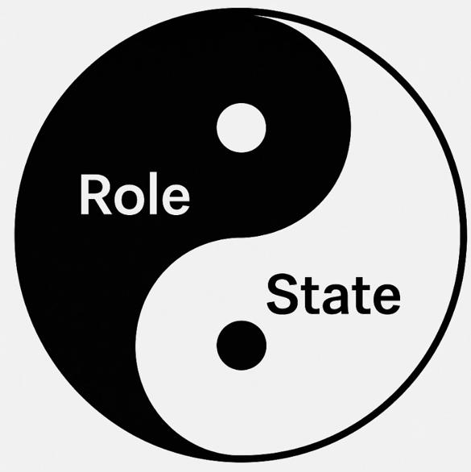

# StOP - State Oriented Programming

State Oriented Programming (StOP) is a programming paradigm that focuses on explicit state management and transformation. This repository provides implementations and examples in multiple programming languages.

  

## Sub-projects

| Project | Description |
|---------|-------------|
| [ts-stop](./ts/ts-stop/DEVELOPMENT.md) | TypeScript/JavaScript library for State-Oriented Programming |
| [ts-example](./ts/ts-example/DEVELOPMENT.md) | JavaScript example demonstrating local usage of ts-stop library |

## Documentation

- **Getting Started**: [StOP Tutorial](./docs/Tutorial/01-StOP-Tutorial.md)
- **Background**: [StOP Motivation](./docs/Tutorial/02-StOP-Motivation.md)
- **Why Now**: [StOP Why Now](./docs/Tutorial/03-StOP-Why-Now.md)
- **Formal Approach**: [StOP Apologia FA](./docs/Tutorial/04-StOP-Apologia-FA.md)
- **Simplest FA**: [StOP The Simplest FA](./docs/Tutorial/05-StOP-The-Simplest-FA.md)

## License

This project is dual-licensed:

- **[Apache 2.0](./LICENSE)** - Free for open-source, academic, and small commercial use
- **[Commercial License](./LICENSE-COMMERCIAL.md)** - For organizations with 10+ employees or projects with $10,000+ annual revenue

**Quick Summary:**
- ✅ Free for individuals and small teams (< 10 employees)
- ✅ Free for non-commercial and low-revenue projects (< $10K/year)
- 📧 Commercial licensing available - contact the author

