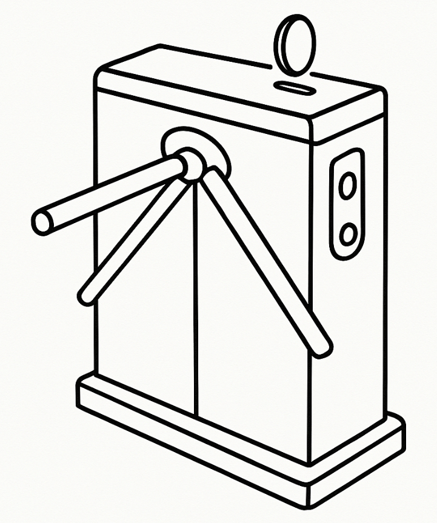

## The Simplest Finite Automaton

Mountains of scientific and educational books and articles have been written about finite automata, which manage in an amazing way to not only confuse the reader, but also to frighten practitioners away from using them.

However, the basic idea of finite automata is as simple as it is fundamental. Namely:

We have:
- **A finite set of states** in which some object can exist, one of which is the initial state
- **A finite number of signals** that can be sent to this object and possibly lead to a change in its state, i.e., a transition from the current state to another

All the magic of finite automata is based on this simple idea.

To define a specific finite automaton, you need to specify a list of its states (States S), signals (Signals G), and transitions (Transitions T) in the form of a list of triples:

`<s0, g, s1>`, where:
- `s0` - the state in which the automaton is currently located (initially - the starting state)
- `g` - the signal
- `s1` - the state to which our object will transition after receiving the signal

Of course, we don't need states in S and signals in G that are not represented in T in any way. For practical use, some other constraints are also important, but we won't delve into the depths of theory for now, and will move on to a concrete programming example.

I haven't forgotten my promise to show the connection between roles and states. We'll do this a bit later. For now, let's examine the use of FA using the example of a very simple automaton - a primitive turnstile that lets someone into the metro or a paid restroom after they drop a coin or special token into its slot. 

Like this:





This automaton has two states: **locked** and **unlocked**, and two signals: **coin received** (coin) and **person passed through** (push).

To define it using the TypeScript StOP library (https://github.com/vsirotin/StOP), which I am currently developing intensively, you need very little. Here's the complete class implementation:

```typescript
export class TurnstileMatrix extends MatrixBasedStateMachine<string, string> {
    constructor() {
        const matrix = transitionMatrix([
            [           , "locked"    , "unlocked" ],
            [ "coin"    , "unlocked" ,             ],
            [ "push"    ,            , "locked"   ]
        ]);
        
        super(matrix, "locked");
    }

    // Convenience methods
    insertCoin(): string { return this.sendSignal('coin'); }
    pushThrough(): string { return this.sendSignal('push'); }
    isLocked(): boolean { return this.getCurrentState() === 'locked'; }
    isUnlocked(): boolean { return this.getCurrentState() === 'unlocked'; }
}
```

As we can see, the automaton itself is defined by a matrix. In it, the elements in the first row in each column, starting from the second (column headers), indicate the states of the automaton. The elements in the first column, starting from the second row (row headers), indicate the signals of the automaton. All remaining matrix elements tell us what state the automaton will transition to if it is in the state indicated in the column header and receives the signal indicated in the row header:

```typescript
const matrix = transitionMatrix([
    [           , "locked"    , "unlocked" ],
    [ "coin"    , "unlocked" ,             ],
    [ "push"    ,            , "locked"    ]
]);
```

Using such a representation is very convenient if our matrix is relatively small and sparse. Otherwise, you can simply use a list of transitions.

In our case, this looks like:

```typescript
{ from: 'locked', signal: 'coin', to: 'unlocked' },
{ from: 'unlocked', signal: 'push', to: 'locked' }
```

If you're interested in the details, you can find them here: https://github.com/vsirotin/StOP/tree/main/ts/ts-stop/test/Turnstile

"But wait," an experienced programmer will say, looking at this example, "these are just text strings, not objects. An object should be able to do something and have its own attributes!"

I completely agree with you. So let me move on to a more complex example.