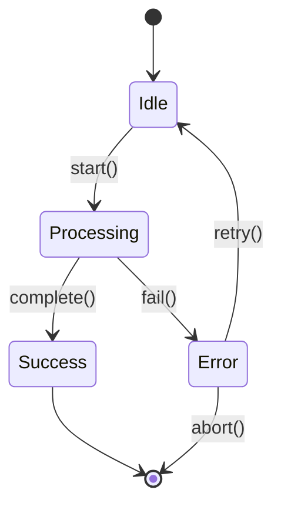

# UML State Machine Setup Guide

## Method 1: Enable UML in Draw.io (RECOMMENDED)

### Steps to Add UML Elements:
1. **Open any .drawio file** in VS Code
2. **Look at the left panel** (shapes library)
3. **Scroll down and click "More Shapes..."** 
4. **Enable these shape libraries:**
   - ✅ **UML**: Class diagrams, use case diagrams
   - ✅ **Software**: UML state machines, activity diagrams  
   - ✅ **Entity Relation**: ER diagrams
   - ✅ **Flowchart**: Process flows
5. **Click "Apply"**

### UML State Machine Elements Available:
- **States**: Initial state, final state, composite states
- **Transitions**: Arrows with conditions/actions
- **Decision nodes**: Diamond shapes for conditions
- **Concurrent regions**: Parallel state execution
- **History states**: Shallow and deep history

## Method 2: Mermaid State Diagrams (Code-based)

### Example Mermaid State Diagram:

### To use Mermaid:
1. Install Mermaid extension
2. Create `.mmd` files with state diagram code
3. Preview in VS Code
4. Export as images

## Method 3: UMLet (Pure UML Tool)

### For complex UML requirements:
- Install UMLet extension
- Create `.uxf` files
- Specialized UML editor
- Export to various formats

## Recommendation for StOP Project

For your State Oriented Programming documentation, I recommend:
1. **Start with Draw.io + UML shapes** (easiest, integrated)
2. **Add Mermaid for simple state diagrams** (version control friendly)
3. **Use UMLet for complex UML** (if needed later)

This gives you flexibility while keeping your existing draw.io workflow!
