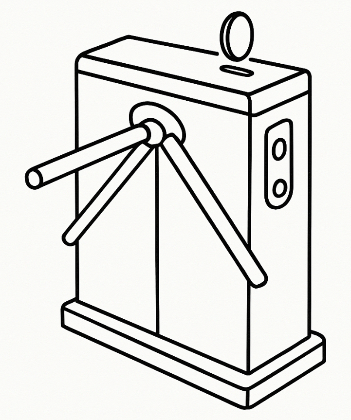
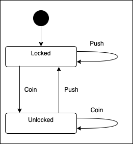

# StOP Tutorial. Chapter 1: Finite State Machines

## 1.1 What is a Finite Automaton?

Mountains of scientific and educational books and articles have been written about finite automata (FA), which manage in an amazing way to not only confuse the reader, but also to frighten practitioners away from using them.

However, the basic idea of a finite automaton is as simple as it is fundamental. 

Namely. We have:
- **A finite set of states** in which some object can exist, one of which is the initial state
- **A finite number of signals** that can be sent to this object and possibly lead to a change in its state, i.e., a transition from the current state to another

All the magic of finite automata is based on this simple idea.

To define a specific finite automaton, you need to specify a list of its states (S), signals (G), and transitions (T) in the form of a list of triples:

`<s0, g, s1>`, where:
- `s0` - the state in which the automaton is currently located (initially - the starting state)
- `g` - the signal
- `s1` - the state to which our object will transition after receiving the signal

For practical use, some other aspects are also important, but we won't delve into the depths of theory for now, and will move on to a concrete programming example.

Let's examine the use of a finite automaton (FA) using the example of a very simple automaton - a primitive turnstile that lets someone into the metro or a paid restroom after they drop a coin or special token into its slot.

Like this:



This automaton has two states: **locked** and **unlocked**, and two signals: **coin received** (coin) and **person passed through** (push).

## 1.2 Defining the turnstile with the StOP library

The [TypeScript StOP library](https://github.com/vsirotin/StOP) processes finite automata with the `Sfsm` engine (available from the `@vsirotin/ts-stop` package). 

SFSM stands for "Stacked Finite State Machine" — a finite automaton that can contain other finite automata as sub-machines, and can be stacked into hierarchies of arbitrary depth. The turnstile is a simple FA with no children, so it is a good starting point for our tutorial. Because of its simple behaviour we talk about finite automata (FA) and not about stacked finite state machine.

One detail of the `Sfsm` engine is important to know from the very first example: every FA always starts in a reserved entry state named `"I"` or, by complex machines with `"*.I"`, e.g. `"BCC.I"`, that means `initial state`. This is not part of the pure theory above — it is the convention. For now, it simply means our turnstile needs one extra transition out of `"I"`.

Here is the complete turnstile FA, written as compact form.:

```typescript
const turnstileFa: FaDefinition = {
    Turnstile: [
        ["I", "start", "locked"],
        ["locked", "coin", "unlocked"],
        ["unlocked", "push", "locked"]
    ]
};
```

This FA can be visually presented as a simple state diagram:
. As you can see, it is a JSON object with a single property `"Turnstile"` that contains an array of transitions. Each transition is a triple of the form `<s0, g, s1>`.


Here is how it is loaded and driven with the `Sfsm` class:

```typescript

const sfsm = new Sfsm(turnstileFa);

sfsm.getHeadState();          // 'I'  — the reserved entry state

sfsm.receiveSignal('start');
sfsm.getHeadState();          // 'locked'

sfsm.receiveSignal('coin');
sfsm.getHeadState();          // 'unlocked'

sfsm.receiveSignal('push');
sfsm.getHeadState();          // 'locked'
```

A runnable version of this exact example is available as a unit test: `1-1-what-is-a-finite-automaton.test.ts`.

### 1.2.1 A type-safe alternative

The plain-string form above is convenient, but nothing stops a typo like `"lokced"` from silently compiling — the `Transition` type accepts any string in each slot. If you would rather have the TypeScript compiler catch such typos, declare your states and signals as string-literal union types first, and write the transition list against them with a small generic helper:

```typescript
import { Sfsm, FaDefinition, Transition } from '@vsirotin/ts-stop/sfsm';

type TurnstileState = 'I' | 'locked' | 'unlocked';
type TurnstileSignal = 'start' | 'coin' | 'push';

// A transition restricted to a specific pair of state/signal literal types.
type TypedTransition<S extends string, G extends string> = [S, G, S];

// Accepts only transitions built from S/G, returns the plain runtime Transition[]
// that Sfsm actually consumes — no change to the library's runtime format.
function typedTransitions<S extends string, G extends string>(
    transitions: Array<TypedTransition<S, G>>
): Transition[] {
    return transitions;
}

const turnstileTransitions = typedTransitions<TurnstileState, TurnstileSignal>([
    ['I',        'start', 'locked'],
    ['locked',   'coin',  'unlocked'],
    ['unlocked', 'push',  'locked'],
    // ['locked', 'coin', 'lokced'],   // ✗ compile error: 'lokced' is not TurnstileState
]);

const turnstileFa: FaDefinition = { Turnstile: turnstileTransitions };

const sfsm = new Sfsm(turnstileFa);
```

This costs nothing at runtime — `typedTransitions()` just returns its argument — but any misspelled state or signal name is now a compile-time error instead of a silent bug. A runnable version of this example is available as a unit test: `1-2-1-type-safe-fa-definition.test.ts`.


## 1.3 Jokers: wildcard signals and states

Writing out every single `<s0, g, s1>` transition by hand works well for a tidy, well-behaved automaton like our turnstile. Real devices, however, are messier: they can receive signals nobody planned for, and they can be told to do the same thing no matter what they happen to be doing at the time. Enumerating every combination by hand would make the transition list explode and, worse, would be all too easy to forget a case.

For this, the `Sfsm` engine supports **jokers** — a reserved value (`"*"` by default) that can stand in for "any signal" or "any state" in a transition:

- A **joker-signal** transition `[s0, "*", s1]` matches *any* signal while the automaton is in state `s0` — but only as a fallback: if a transition for the exact, literal signal already exists for `s0`, that one wins.
- A **joker-state** transition `["*", g, s1]` matches signal `g` from *any* current state — again only as a fallback, behind any transition that names the exact, literal state.

Because jokers are only a fallback, you can freely mix them with ordinary transitions without worrying about ordering: an exact match always takes priority, so the recommendation is simply to place joker transitions last in the list, purely for readability.

Jokers are configured through `SfsmOptions` when constructing the engine:

```typescript
const sfsm = new Sfsm({
  jokerSignal: '*', // default — the value that means "any signal"
  jokerState:  '*'  // default — the value that means "any state"
});
```

You will rarely need to change these from the default `"*"`; the option exists mainly so you can pick a different symbol if `"*"` ever needs to be a real state or signal name in your own FA.

### 1.3.1 Joker signal: reacting to the unexpected (e.g. a power failure)

Imagine our turnstile's electronics can, at any moment, receive all sorts of diagnostic signals from its sensors — most of which are irrelevant, except that *any* signal that isn't part of its normal vocabulary (`coin`, `push`) should be treated as a sign that something is wrong (power dropping out, a sensor glitching, a cable disconnected...) and the safest reaction is to shut the turnstile down into a safe `off` state.

Instead of trying to list every possible malfunction signal, one joker-signal transition per operational state covers all of them at once:

```json
{
  "Turnstile": [
    ["I",        "start", "locked"],
    ["locked",   "coin",  "unlocked"],
    ["unlocked", "push",  "locked"],
    ["locked",   "*",     "off"],
    ["unlocked", "*",     "off"]
  ]
}
```

The turnstile keeps behaving exactly as before for `coin` and `push`; only signals it has no explicit rule for fall through to `*` and trigger the safety shutdown.

A runnable version of this example is available as a unit test: `1-3-1-joker-signal.test.ts`.

### 1.3.2 Joker state: a universal signal for technical personnel

Now imagine the opposite situation: a maintenance technician needs to send a `service` signal that must always work, no matter what the turnstile happens to be doing — locked, unlocked, mid-transaction, or even already `off`. The technician should not need to know (or care) about the turnstile's current state; they just need "put this thing into maintenance mode, now."

A single joker-state transition expresses exactly that, regardless of how many operational states the FA has:

```json
{
  "Turnstile": [
    ["I",        "start",   "locked"],
    ["locked",   "coin",    "unlocked"],
    ["unlocked", "push",    "locked"],
    ["*",        "service", "maintenance"]
  ]
}
```

One transition now covers "enter maintenance mode" from every current and future state — including states added to the FA later, with no changes needed to the `service` rule itself.

A runnable version of this example is available as a unit test: `1-3-2-joker-state.test.ts`.


## 1.4 Senders, receivers and commands

An FA defines the pure behaviour of a system, but says nothing about what supports that behaviour. Who sends signals to the FA? How does the external world react when the FA changes state?

The StOP approach makes minimal assumptions about these surrounding objects. It assumes that some objects (**signal senders**) send signals to the FA, and that some objects (**signal receivers**) receive signals and react by performing actions. An object that is both a sender and a receiver is called a **transceiver**.

External senders and receivers can be connected to the FA through a special API described in the next chapter.

For simulation and rapid prototyping, the StOP library provides a simple declarative JSON format for defining senders, receivers, and commands that wire external objects to the FA.

Let us extend the turnstile example. To make the simulation more realistic, we model the object that sends the `"start"` signal. Assume it is a button that, when pressed, sends `"start"` to the FA. We define it as a sender:

```json
{
  "StartButton": {
    "signals": ["start"]
  }
}
```

Another aspect. Now consider the transition:

```json
["locked", "coin", "unlocked"]
```

What happens when the inserted coin is not valid? We need a coin validator object that inspects the coin and sends either `"validCoin"` or `"invalidCoin"` back to the FA. This validator is defined as a receiver with a **command** — an action the FA invokes when it enters a specific state:

```json
{
  "CoinValidator": {
    "commands": {
      "validateCoin": {
        "signals": ["validCoin", "invalidCoin"]
      }
    }
  }
}
```

A command is triggered by appending its name as the fourth element of a transition. When the FA fires that transition, it sends the command to the designated **command receiver**. The command receiver (itself or via another object) then sends one of its declared result signals back into the FA. 

The original `"coin"` transition is therefore split into an intermediate validation state plus the two outcome transitions:

```json
{
  "Turnstile": [
    ["I",          "start",       "locked"],
    ["locked",     "coin",        "validation", "validateCoin"],
    ["validation", "validCoin",   "unlocked"],
    ["validation", "invalidCoin", "locked"],
    ["unlocked",   "push",        "locked"],
    ["*",          "service",     "maintenance"]
  ]
}
```

Each command is executed at the end of transition processing and may use information from the current state and the incoming signal.

---
In the [next chapter](./02-stacked-finite-state-machine.md) we will see how to combine multiple FAs into a hierarchy, and how the `Sfsm` engine processes signals through that hierarchy.


